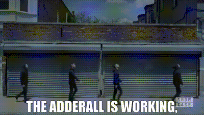

<h1 align="center">Hi there, I'm l1th1um 👋</h1>

  

  

---

### 👤 About Me
- 💻 **Software Developer & Tech Enthusiast**
- 🛡️ Passionate about low-level and high-level programming, IoT, and automation.
- ⚙️ Operating System: **Linux (Void)** | **Windows** 🐧
- 🌱 Education: **GPA-4.8**

---

### 🎖️ Achievments
- 🥇 WRO Future Innovators Junior 2026 Regional - First place
- 🥈 WRO Future Innovators Junior 2026 Almaty - Second place
- 🌱🥇 NIS Project Fest Computer Science 2025 School stage - First place
- 🌱🥇 Computer Science Junior Olympiad School stage - First place
- 🌱📜 Computer Science Junior Olympiad Network stage - Certificate

### 📚 Tech Stack

  
<b>🚀 Languages & Databases</b>

   
  

 

  
<b>🛠️ Frameworks & Frontend</b>

   
  

 

  
<b>🧰 Tools & DevOps</b>

   
  

 

  
<b>🔌 Hardware & Software</b>

   
  

---

